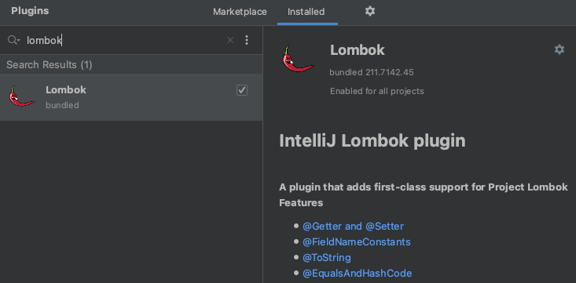

# 프로젝트 생성

### 강의 항목

* 강좌 소개
* 수업 자료
* 프로젝트 생성
* 라이브러리 살펴보기


### 학습 내용

* Spring boot를 IntelliiJ와 스프링부트 홈페이지에서 생성할 수 있다.
  * Dependencies 추가를 쉽게 하기 위해서는 스프링부트 [홈페이지](https://start.spring.io/)에서 하는 것이 좋다.

```java
plugins {
    id 'org.springframework.boot' version '2.5.0'
    id 'io.spring.dependency-management' version '1.0.11.RELEASE'
    id 'java'
}

group = 'what.the'
version = '0.0.1-SNAPSHOT'
sourceCompatibility = '11'

configurations {
    compileOnly {
        extendsFrom annotationProcessor
    }
}

repositories {
    mavenCentral()
}

dependencies {
    implementation 'org.springframework.boot:spring-boot-starter-data-jpa'
    implementation 'org.springframework.boot:spring-boot-starter-validation'
    implementation 'org.springframework.boot:spring-boot-starter-thymeleaf'
    implementation 'org.springframework.boot:spring-boot-starter-web'

    compileOnly 'org.projectlombok:lombok'
    runtimeOnly 'com.h2database:h2'

    annotationProcessor 'org.projectlombok:lombok'
    testImplementation 'org.springframework.boot:spring-boot-starter-test'

    //JUnit4 추가
    testImplementation("org.junit.vintage:junit-vintage-engine") {
        exclude group: "org.hamcrest", module: "hamcrest-core"
    }

}

test {
    useJUnitPlatform()
}

```

* 추가하는 Dependencies
  * Spring Web
  * Thymeleaf
  * Spring Data JPA
  * H2 Database
  * Lombok
* Lombok 플러그
  * Preferences `(command + ,)`
  * Marketplace tab
  * \(미설치시\) Lombok 검색 후 Install
  * \(설치시\) 적용되어 있는지 확인



* Lombok 설치 후
  * Preference - Annotation Processors
  * 상단 `Enable annotation processing` check
* 스프링부트 및 Lombok 동작 테스트
  * 아래 코드 Run
  * 참고로 본 샘플은 필자의 [github](https://github.com/conquerex/WhatTheJpa2nd)에도 확인 가능

```java
import org.springframework.boot.SpringApplication;
import org.springframework.boot.autoconfigure.SpringBootApplication;

@SpringBootApplication
public class Jpa2ndApplication {

	public static void main(String[] args) {
		Hello hello = new Hello();
		hello.setData("ddd");
		String data = hello.getData();

		SpringApplication.run(Jpa2ndApplication.class, args);
	}

}
```

```java
import org.junit.jupiter.api.Test;
import org.springframework.boot.test.context.SpringBootTest;

@SpringBootTest
class Jpa2ndApplicationTests {

	@Test
	void contextLoads() {
	}

}
```

* Build and run
  * Preferences --&gt; Build, Execution, Deployment --&gt; Build Tools --&gt; Gradle
  * Build and run using : **IntelliJ IDEA**
  * Run tests using : **IntelliJ IDEA**


